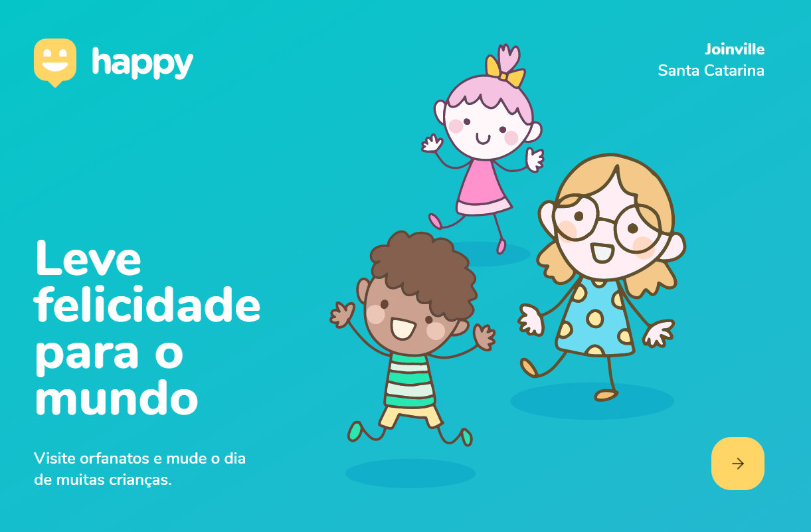
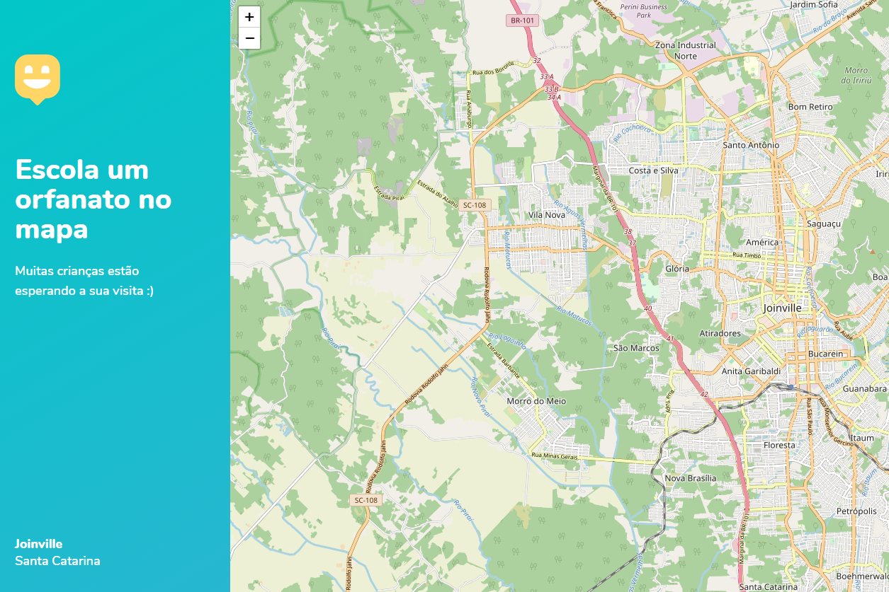

</header>
  

  <h1 align="center"> Happy </h1>
  
 
    <strong>Projeto feito para facilitar a localização de orfanatos em Joinville, Santa Catarina.</strong> 
  

  
 
  <a href="status">Status do projeto</a> •
    <a href="preview">Preview</a> •
    <a href="tecnologias">Tecnologias</a> •
    <a href="instalacao">Instalação</a> •
    <a href="autor">Autor</a> •
    <a href="licenc-a">Licença</a>
  

</header>
<main>
  

    <h2 align="center">Status do projeto</h2>
    <h4 align="center">
      🚧 O projeto está em desenvolvimento. 🚧
    </h4>
  

  

    <h2> Preview </h2>
    
    
  

</main>
